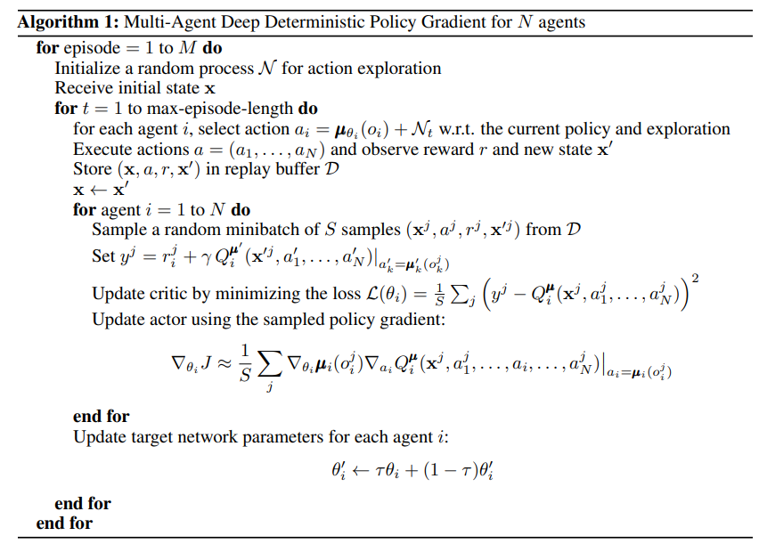
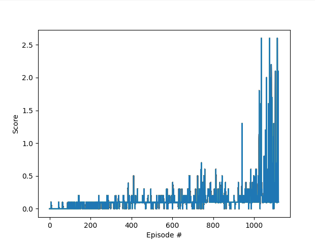
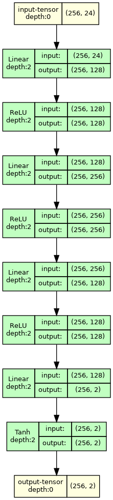
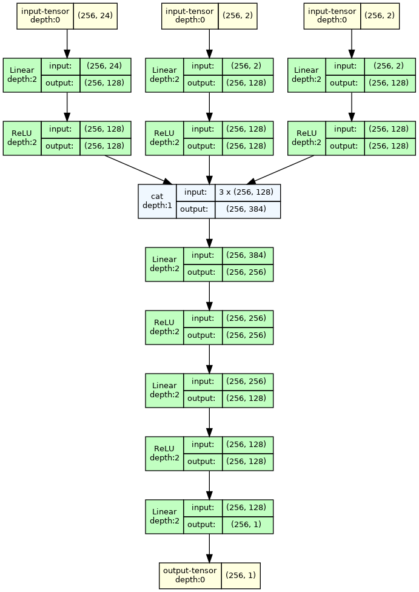

# Implementation details
___

## Deep Deterministic Policy Gradient (DDPG)
In order to solve this problem Multi Agent Deep Deterministic Policy Gradient (MADDPG) method was employed. 
Algorithm is depicted on below picture [1]:  

### Plot of rewards

Problem goal was reached at __1122nd episode__.

### Utilized hyperparameters

| Parameter                            | Value   |
|--------------------------------------|---------|
| max timestamps per episode           | 10,000  |
| gamma `γ`                            | 0.99    |
| tau `τ`                              | 0.01    |
| learning rate `µ` (actor)            | 0.0003  |
| learning rate `µ` (critic)           | 0.001   |
| buffer size                          | 100,000 |
| minibatch size                       | 256     |
| optimization loops for one timestamp | 2       |

### Model architecture

#### Actor network:

#### Critic network:

## Ideas for improvements

- Optimization of hyperparameters (tools like _Optuna_ could be used)
- Trying another algorithm, e.g. Trust Region Policy Optimization (TRPO) [2], Policy Proximal Optimization (PPO) [3]
or Distributed Distributional Deterministic Policy Gradients (D4PG) [4]

[[1] Multi-Agent Actor-Critic for Mixed Cooperative-Competitive Environments](https://arxiv.org/abs/1706.02275)
[[2] Trust Region Policy Optimization](https://arxiv.org/abs/1502.05477)  
[[3] Proximal Policy Optimization](https://arxiv.org/abs/1707.06347)  
[[4] Distributed Distributional Deterministic Policy Gradients](https://openreview.net/forum?id=SyZipzbCb)  
